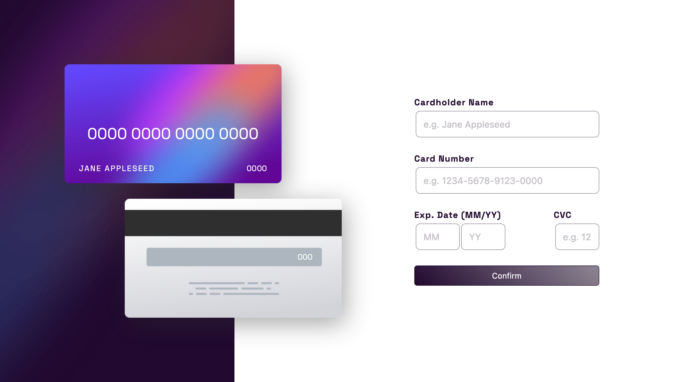
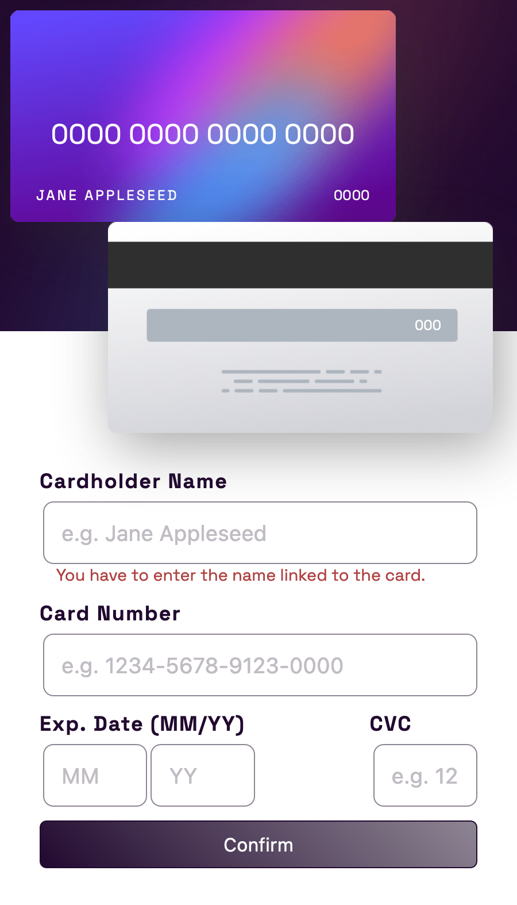

# Frontend Mentor - Interactive card details form solution

This is a solution to the [Interactive card details form challenge on Frontend Mentor](https://www.frontendmentor.io/challenges/interactive-card-details-form-XpS8cKZDWw). Frontend Mentor challenges help you improve your coding skills by building realistic projects. 

## Table of contents

- [Overview](#overview)
  - [The challenge](#the-challenge)
  - [Screenshot](#screenshot)
  - [Links](#links)
- [My process](#my-process)
  - [Built with](#built-with)
  - [What I learned](#what-i-learned)
  - [Continued development](#continued-development)
  - [Useful resources](#useful-resources)
- [Author](#author)
- [Acknowledgments](#acknowledgments)

**Note: Delete this note and update the table of contents based on what sections you keep.**

## Overview

### The challenge

Users should be able to:

- Fill in the form and see the card details update in real-time
- Receive error messages when the form is submitted if:
  - Any input field is empty
  - The card number, expiry date, or CVC fields are in the wrong format
- View the optimal layout depending on their device's screen size
- See hover, active, and focus states for interactive elements on the page

### Screenshot

### Links

- Solution URL: [Add solution URL here](https://github.com/yefreescoding/Interactive-card-details-form.git)
- Live Site URL: [Add live site URL here](https://yefreescoding.github.io/Interactive-card-details-form/)

## My process

### Built with

- Semantic HTML5 markup
- CSS custom properties
- Flexbox
- CSS Grid
- JavaScript

### What I learned
I learned how to implement visual responsive outcomes to user inputs using JavaScript, CSS ad HTML.

### Continued development

I want to focus more on mobile-first web design. I think that's going to be essential part of my future web design career.

These could be concepts you're still not completely comfortable with or techniques you found useful that you want to refine and perfect.
Also develop my understanding and abilities with JavaScript on the front-end before immerse myself fully into the back-end.

### Useful resources

- [Example resource 1](https://www.youtube.com/watch?v=nNIr0lF7KnU) - This helped me in for the 'error' messages display.

## Author

- Website - [Add your name here](https://github.com/yefreescoding)
- Frontend Mentor - [@yefreescoding](https://www.frontendmentor.io/profile/yefreescoding)
- Twitter - [@YefreeCodes](https://twitter.com/YefreeCodes)

## Acknowledgments

This is where you can give a hat tip to anyone who helped you out on this project. Perhaps you worked in a team or got some inspiration from someone else's solution. This is the perfect place to give them some credit.
